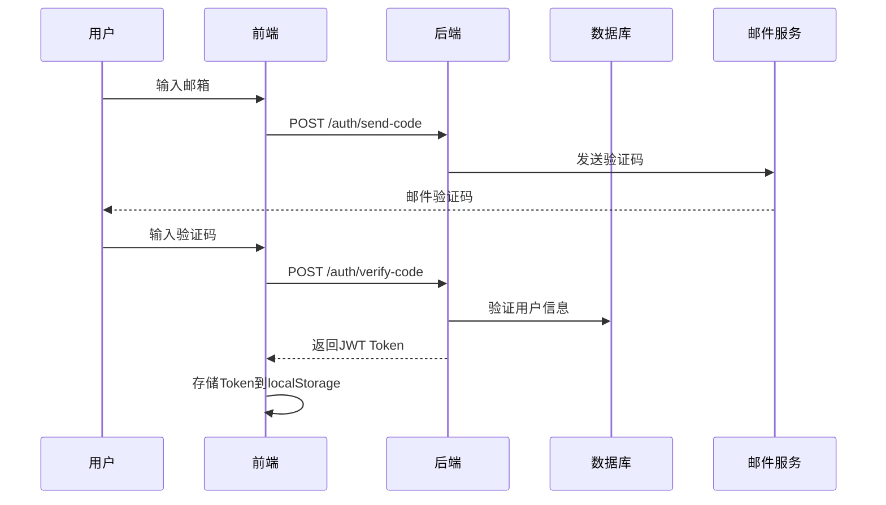
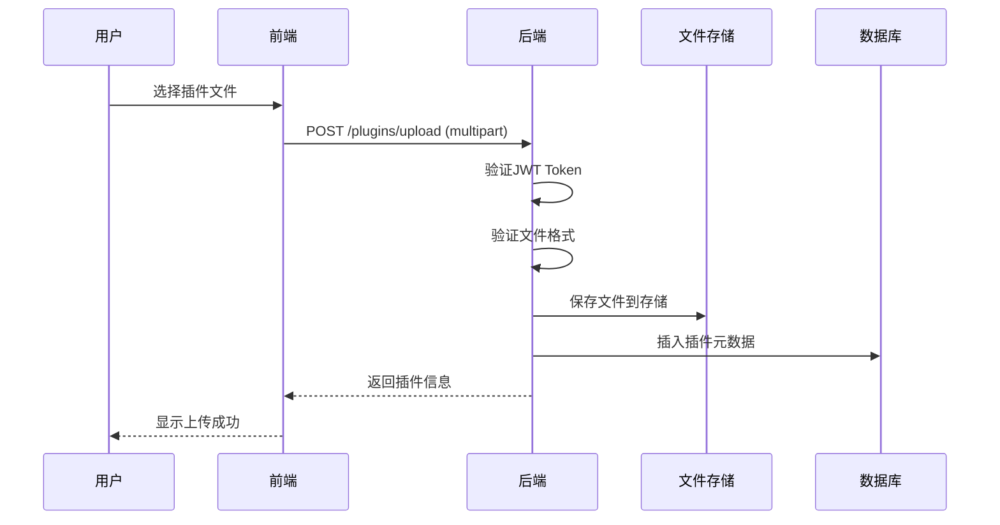

# 系统架构概述

## 系统简介

GeekTools 插件市场是一个全栈Web应用程序，用于管理和分发 GeekTools 工具的插件。系统采用现代化的微服务架构设计，支持高并发、高可用性和水平扩展。

## 整体架构

```
┌─────────────────┐    ┌─────────────────┐    ┌─────────────────┐
│   前端客户端     │    │   反向代理       │    │   后端服务       │
│                │    │                │    │                │
│  • HTML/JS/CSS │◄──►│  • Nginx/Apache │◄──►│  • Rust/Axum   │
│  • Tailwind CSS│    │  • SSL终止      │    │  • JWT认证      │
│  • 响应式设计   │    │  • 负载均衡     │    │  • 文件上传     │
└─────────────────┘    └─────────────────┘    └─────────────────┘
                                                       │
                                                       ▼
┌─────────────────┐    ┌─────────────────┐    ┌─────────────────┐
│   文件存储       │    │   邮件服务       │    │   数据库        │
│                │    │                │    │                │
│  • 本地文件系统  │◄──►│  • SMTP支持     │◄──►│  • PostgreSQL   │
│  • 插件包存储   │    │  • 邮箱验证     │    │  • 连接池       │
│  • 临时文件处理 │    │  • 异步发送     │    │  • 事务支持     │
└─────────────────┘    └─────────────────┘    └─────────────────┘
```

## 技术栈选型

### 后端技术栈

| 组件 | 技术选型 | 版本 | 用途说明 |
|------|----------|------|----------|
| **Web框架** | Axum | 0.7 | 高性能异步Web框架，基于Tokio |
| **运行时** | Tokio | 1.0 | 异步运行时，支持高并发 |
| **数据库** | PostgreSQL | 14+ | 关系型数据库，ACID事务支持 |
| **ORM** | SQLx | 0.7 | 编译时检查的SQL工具包 |
| **认证** | JWT | - | 无状态token认证机制 |
| **密码加密** | bcrypt | 0.15 | 安全的密码哈希算法 |
| **邮件服务** | Lettre | 0.11 | SMTP邮件发送库 |
| **文件处理** | tar/flate2 | - | 插件包压缩解压 |
| **日志** | tracing | 0.1 | 结构化日志记录 |

### 前端技术栈

| 组件 | 技术选型 | 版本 | 用途说明 |
|------|----------|------|----------|
| **样式框架** | Tailwind CSS | 3.x | 原子化CSS框架 |
| **图标库** | Font Awesome | 6.4 | 矢量图标库 |
| **JavaScript** | 原生ES6+ | - | 无框架依赖，轻量化 |
| **构建工具** | 无 | - | 静态文件直接部署 |

### 基础设施

| 组件 | 技术选型 | 用途说明 |
|------|----------|----------|
| **容器化** | Docker | 应用打包和部署 |
| **容器编排** | Docker Compose | 多服务编排 |
| **反向代理** | Nginx | 静态文件服务和负载均衡 |
| **数据库** | PostgreSQL | 持久化数据存储 |

## 核心模块架构

### 1. 认证授权模块

```rust
Authentication Module
├── JWT Token管理
│   ├── Access Token (1小时有效期)
│   └── Refresh Token (7天有效期)
├── 密码安全
│   ├── bcrypt哈希加密
│   └── 盐值随机生成
└── 邮箱验证
    ├── 验证码生成
    └── SMTP邮件发送
```

### 2. 插件管理模块

```rust
Plugin Management Module
├── 插件元数据管理
│   ├── 基本信息存储
│   ├── 版本管理
│   └── 状态管理
├── 文件处理
│   ├── tar.gz压缩包上传
│   ├── 文件完整性校验
│   └── 存储路径管理
└── 权限控制
    ├── 上传权限验证
    └── 下载统计跟踪
```

### 3. 搜索引擎模块

```rust
Search Engine Module
├── 全文搜索
│   ├── 插件名称搜索
│   ├── 描述内容搜索
│   └── 作者信息搜索
├── 过滤功能
│   ├── 状态过滤
│   ├── 评分过滤
│   └── 时间范围过滤
└── 排序算法
    ├── 相关度排序
    ├── 下载量排序
    └── 更新时间排序
```

### 4. 管理后台模块

```rust
Admin Module
├── 用户管理
│   ├── 用户列表查询
│   ├── 用户状态管理
│   └── 登录活动追踪
├── 插件管理
│   ├── 插件审核
│   ├── 状态变更
│   └── 数据统计
└── 系统维护
    ├── SQL查询执行
    ├── 系统监控
    └── 数据备份
```

## 数据流架构

### 用户认证流程



### 插件上传流程



## 安全架构设计

### 1. 认证安全

- **JWT Token**: 使用RS256算法签名，支持Token刷新
- **密码安全**: bcrypt哈希加密，cost factor = 12
- **会话管理**: 无状态设计，支持分布式部署

### 2. 输入验证

- **参数验证**: 使用validator库进行严格参数校验
- **文件验证**: 上传文件类型、大小、内容检查
- **SQL注入防护**: 使用参数化查询，SQLx编译时检查

### 3. 权限控制

- **RBAC模型**: 基于角色的访问控制
- **API权限**: 中间件层统一权限验证
- **资源隔离**: 用户只能操作自己的资源

### 4. 通信安全

- **HTTPS强制**: 生产环境强制SSL/TLS加密
- **CORS配置**: 严格的跨域资源共享策略
- **请求限流**: 基于IP的请求频率限制

## 性能架构设计

### 1. 数据库性能

- **连接池**: 配置合理的数据库连接池大小
- **索引优化**: 针对查询模式创建高效索引
- **查询优化**: 避免N+1查询，使用批量操作

### 2. 缓存策略

- **应用缓存**: 热点数据内存缓存
- **HTTP缓存**: 静态资源浏览器缓存
- **数据库缓存**: PostgreSQL查询结果缓存

### 3. 文件处理性能

- **异步I/O**: 使用Tokio异步文件操作
- **流式处理**: 大文件流式上传下载
- **压缩优化**: gzip压缩减少传输量

## 可扩展性设计

### 1. 水平扩展

- **无状态设计**: 应用服务器无状态，支持负载均衡
- **数据库分片**: 支持读写分离和分库分表
- **微服务拆分**: 模块化设计便于服务拆分

### 2. 垂直扩展

- **资源调优**: CPU、内存、磁盘资源优化配置
- **并发控制**: 合理的线程池和连接池配置
- **性能监控**: 完善的性能指标监控体系

## 部署架构

### 开发环境

```
Development Environment
├── 本地开发服务器 (cargo run)
├── 本地PostgreSQL数据库
├── Python代理服务器 (CORS处理)
└── 热重载支持
```

### 生产环境

```
Production Environment
├── Docker容器化部署
├── Nginx反向代理
├── PostgreSQL主从复制
├── 日志聚合和监控
└── 自动备份策略
```

这种架构设计确保了系统的高性能、高可用性和良好的可维护性，适合从小规模到大规模的部署需求。