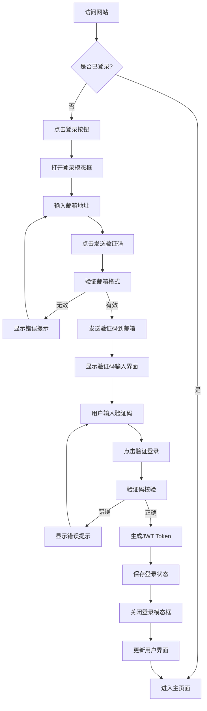
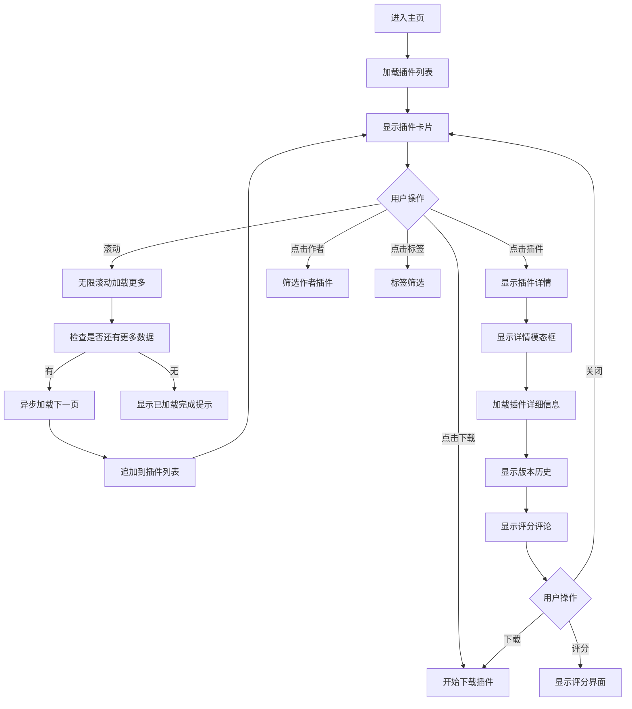
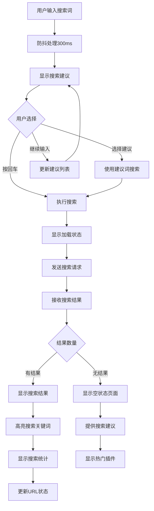
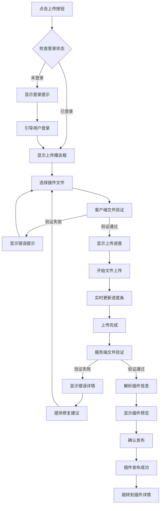
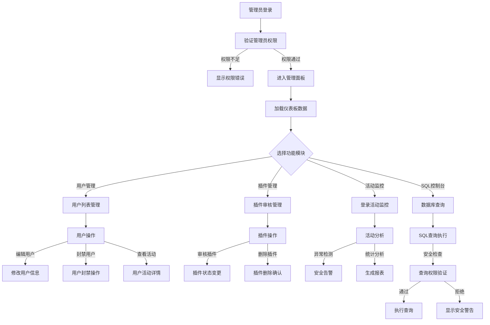

# 用户交互流程设计

## 概述

GeekTools 插件市场的用户交互流程设计注重用户体验的流畅性和直观性。本文档详细描述了各种用户场景下的交互流程，包括用户认证、插件浏览、搜索、上传、管理等核心功能的用户体验设计。

## 核心用户流程

### 1. 用户注册和登录流程

#### 1.1 邮箱验证登录流程



**交互实现**:

```javascript
class AuthenticationFlow {
    async handleLogin() {
        // 步骤1: 显示登录模态框
        this.showLoginModal();
    }
    
    async sendVerificationCode() {
        const email = document.getElementById('emailInput').value.trim();
        
        // 步骤2: 客户端验证
        if (!this.validateEmail(email)) {
            this.showError('请输入有效的邮箱地址');
            return;
        }
        
        // 步骤3: 显示加载状态
        this.setLoadingState('sendCodeBtn', true, '发送中...');
        
        try {
            // 步骤4: 发送验证码请求
            const response = await fetch(`${this.baseURL}/auth/send-code`, {
                method: 'POST',
                headers: { 'Content-Type': 'application/json' },
                body: JSON.stringify({ email })
            });
            
            const data = await response.json();
            
            if (data.success) {
                // 步骤5: 切换到验证码输入界面
                this.switchToCodeVerification(data.data);
                this.showSuccess('验证码已发送到您的邮箱');
            } else {
                this.showError(data.error || '发送失败，请重试');
            }
        } catch (error) {
            this.showError('网络错误，请检查网络连接');
        } finally {
            this.setLoadingState('sendCodeBtn', false, '发送验证码');
        }
    }
    
    async verifyCode() {
        const email = document.getElementById('emailInput').value.trim();
        const code = document.getElementById('codeInput').value.trim();
        
        // 验证输入
        if (!code || code.length !== 6) {
            this.showError('请输入6位验证码');
            return;
        }
        
        this.setLoadingState('verifyCodeBtn', true, '验证中...');
        
        try {
            const response = await fetch(`${this.baseURL}/auth/verify-code`, {
                method: 'POST',
                headers: { 'Content-Type': 'application/json' },
                body: JSON.stringify({ email, code })
            });
            
            const data = await response.json();
            
            if (data.success) {
                // 保存认证信息
                this.saveAuthData(data.data);
                this.hideLoginModal();
                this.updateAuthUI();
                this.showSuccess('登录成功！');
            } else {
                this.showError(data.error || '验证码错误');
            }
        } catch (error) {
            this.showError('验证失败，请重试');
        } finally {
            this.setLoadingState('verifyCodeBtn', false, '验证登录');
        }
    }
    
    switchToCodeVerification(data) {
        document.getElementById('sendCodeStep').classList.add('hidden');
        document.getElementById('verifyCodeStep').classList.remove('hidden');
        
        // 开发环境显示验证码
        if (data.code) {
            document.getElementById('codeDisplay').classList.remove('hidden');
            document.getElementById('displayedCode').textContent = data.code;
        }
        
        // 聚焦到验证码输入框
        setTimeout(() => {
            document.getElementById('codeInput').focus();
        }, 100);
    }
}
```

#### 1.2 用户体验优化

**加载状态管理**:
```javascript
setLoadingState(buttonId, isLoading, loadingText) {
    const button = document.getElementById(buttonId);
    
    if (isLoading) {
        button.disabled = true;
        button.classList.add('btn-loading');
        button.dataset.originalText = button.textContent;
        button.textContent = loadingText;
    } else {
        button.disabled = false;
        button.classList.remove('btn-loading');
        button.textContent = button.dataset.originalText;
    }
}
```

**错误处理和重试机制**:
```javascript
handleAuthError(error, retryCallback) {
    const errorMessages = {
        'network_error': '网络连接失败，请检查网络',
        'invalid_email': '邮箱格式不正确',
        'code_expired': '验证码已过期，请重新获取',
        'code_invalid': '验证码错误，请重新输入',
        'rate_limited': '请求过于频繁，请稍后再试'
    };
    
    const message = errorMessages[error.code] || error.message || '操作失败';
    
    // 显示错误消息和重试按钮
    this.showErrorWithRetry(message, retryCallback);
}

showErrorWithRetry(message, retryCallback) {
    const errorElement = document.createElement('div');
    errorElement.className = 'error-message-with-retry p-4 bg-red-50 border border-red-200 rounded-lg';
    errorElement.innerHTML = `
        <div class="flex items-center justify-between">
            <div class="flex items-center">
                <i class="fas fa-exclamation-circle text-red-500 mr-2"></i>
                <span class="text-red-800">${message}</span>
            </div>
            <button onclick="this.closest('.error-message-with-retry').remove(); ${retryCallback.name}()" 
                    class="text-red-600 hover:text-red-800 text-sm underline">
                重试
            </button>
        </div>
    `;
    
    // 插入到适当位置
    const container = document.querySelector('.modal-body');
    container.insertBefore(errorElement, container.firstChild);
    
    // 5秒后自动消失
    setTimeout(() => {
        if (errorElement.parentNode) {
            errorElement.remove();
        }
    }, 5000);
}
```

### 2. 插件浏览和搜索流程

#### 2.1 插件浏览流程



**无限滚动实现**:
```javascript
class InfiniteScrollManager {
    constructor(container, loadCallback) {
        this.container = container;
        this.loadCallback = loadCallback;
        this.isLoading = false;
        this.hasMore = true;
        this.page = 1;
        
        this.init();
    }
    
    init() {
        this.createSentinel();
        this.setupIntersectionObserver();
    }
    
    createSentinel() {
        this.sentinel = document.createElement('div');
        this.sentinel.id = 'scroll-sentinel';
        this.sentinel.className = 'h-10 flex items-center justify-center';
        this.sentinel.innerHTML = `
            <div class="loading-indicator hidden">
                <i class="fas fa-spinner fa-spin text-claude-orange mr-2"></i>
                <span class="text-gray-600">加载更多插件...</span>
            </div>
            <div class="load-more-btn">
                <button onclick="infiniteScroll.loadMore()" 
                        class="btn btn-secondary">
                    <i class="fas fa-chevron-down mr-2"></i>
                    加载更多
                </button>
            </div>
            <div class="no-more-data hidden text-gray-500 text-center">
                <i class="fas fa-check-circle mr-2"></i>
                已加载全部插件
            </div>
        `;
        
        this.container.appendChild(this.sentinel);
    }
    
    setupIntersectionObserver() {
        const options = {
            root: null,
            rootMargin: '100px',
            threshold: 0.1
        };
        
        this.observer = new IntersectionObserver((entries) => {
            entries.forEach(entry => {
                if (entry.isIntersecting && !this.isLoading && this.hasMore) {
                    this.loadMore();
                }
            });
        }, options);
        
        this.observer.observe(this.sentinel);
    }
    
    async loadMore() {
        if (this.isLoading || !this.hasMore) return;
        
        this.isLoading = true;
        this.showLoadingState();
        
        try {
            const result = await this.loadCallback(this.page + 1);
            
            if (result.plugins && result.plugins.length > 0) {
                this.page++;
                this.appendPlugins(result.plugins);
                
                // 检查是否还有更多数据
                if (result.plugins.length < result.pagination.limit) {
                    this.hasMore = false;
                    this.showNoMoreData();
                }
            } else {
                this.hasMore = false;
                this.showNoMoreData();
            }
        } catch (error) {
            this.showError('加载失败，请重试');
        } finally {
            this.isLoading = false;
            this.hideLoadingState();
        }
    }
    
    showLoadingState() {
        this.sentinel.querySelector('.loading-indicator').classList.remove('hidden');
        this.sentinel.querySelector('.load-more-btn').classList.add('hidden');
    }
    
    hideLoadingState() {
        this.sentinel.querySelector('.loading-indicator').classList.add('hidden');
        if (this.hasMore) {
            this.sentinel.querySelector('.load-more-btn').classList.remove('hidden');
        }
    }
    
    showNoMoreData() {
        this.sentinel.querySelector('.load-more-btn').classList.add('hidden');
        this.sentinel.querySelector('.no-more-data').classList.remove('hidden');
    }
    
    appendPlugins(plugins) {
        const pluginsGrid = document.getElementById('pluginsGrid');
        const fragment = document.createDocumentFragment();
        
        plugins.forEach(plugin => {
            const pluginElement = this.createPluginCard(plugin);
            fragment.appendChild(pluginElement);
        });
        
        // 在sentinel之前插入新插件
        pluginsGrid.insertBefore(fragment, this.sentinel);
        
        // 添加进入动画
        const newCards = pluginsGrid.querySelectorAll('.plugin-card:not(.animated)');
        newCards.forEach((card, index) => {
            card.classList.add('animated');
            setTimeout(() => {
                card.classList.add('slide-in-up');
            }, index * 100);
        });
    }
}
```

#### 2.2 搜索流程优化



**搜索功能实现**:
```javascript
class SearchManager {
    constructor() {
        this.searchInput = document.getElementById('searchInput');
        this.suggestionsContainer = document.getElementById('searchSuggestions');
        this.resultsContainer = document.getElementById('searchResults');
        this.debounceTimer = null;
        this.currentQuery = '';
        this.suggestionCache = new Map();
        
        this.init();
    }
    
    init() {
        this.bindEvents();
        this.setupSearchSuggestions();
    }
    
    bindEvents() {
        // 搜索输入事件
        this.searchInput.addEventListener('input', (e) => {
            this.handleSearchInput(e.target.value);
        });
        
        // 回车搜索
        this.searchInput.addEventListener('keydown', (e) => {
            if (e.key === 'Enter') {
                e.preventDefault();
                this.executeSearch(this.searchInput.value);
            } else if (e.key === 'ArrowDown') {
                this.navigateSuggestions('down');
            } else if (e.key === 'ArrowUp') {
                this.navigateSuggestions('up');
            } else if (e.key === 'Escape') {
                this.hideSuggestions();
            }
        });
        
        // 点击外部隐藏建议
        document.addEventListener('click', (e) => {
            if (!this.searchInput.contains(e.target) && 
                !this.suggestionsContainer.contains(e.target)) {
                this.hideSuggestions();
            }
        });
    }
    
    handleSearchInput(query) {
        // 清除之前的防抖定时器
        clearTimeout(this.debounceTimer);
        
        this.currentQuery = query.trim();
        
        if (this.currentQuery.length === 0) {
            this.hideSuggestions();
            this.showAllPlugins();
            return;
        }
        
        // 防抖处理
        this.debounceTimer = setTimeout(() => {
            this.loadSearchSuggestions(this.currentQuery);
        }, 300);
    }
    
    async loadSearchSuggestions(query) {
        if (query.length < 2) {
            this.hideSuggestions();
            return;
        }
        
        // 检查缓存
        if (this.suggestionCache.has(query)) {
            this.displaySuggestions(this.suggestionCache.get(query));
            return;
        }
        
        try {
            const response = await fetch(
                `${this.baseURL}/search/suggestions?q=${encodeURIComponent(query)}&limit=8`
            );
            const data = await response.json();
            
            if (data.success && data.data.suggestions) {
                // 缓存结果
                this.suggestionCache.set(query, data.data.suggestions);
                this.displaySuggestions(data.data.suggestions);
            }
        } catch (error) {
            console.error('Failed to load suggestions:', error);
        }
    }
    
    displaySuggestions(suggestions) {
        if (suggestions.length === 0) {
            this.hideSuggestions();
            return;
        }
        
        this.suggestionsContainer.innerHTML = suggestions.map(suggestion => `
            <div class="suggestion-item px-4 py-2 hover:bg-gray-50 cursor-pointer border-b border-gray-100 last:border-b-0"
                 onclick="searchManager.selectSuggestion('${suggestion.text}')">
                <div class="flex items-center justify-between">
                    <div class="flex items-center">
                        <i class="fas ${this.getSuggestionIcon(suggestion.type)} text-gray-400 mr-3"></i>
                        <span class="suggestion-text">${suggestion.highlight}</span>
                    </div>
                    <div class="text-xs text-gray-500">
                        ${suggestion.type === 'plugin' ? suggestion.match_count + ' 个插件' : suggestion.category}
                    </div>
                </div>
            </div>
        `).join('');
        
        this.showSuggestions();
    }
    
    getSuggestionIcon(type) {
        const icons = {
            plugin: 'fa-plug',
            author: 'fa-user',
            tag: 'fa-tag',
            category: 'fa-folder'
        };
        return icons[type] || 'fa-search';
    }
    
    selectSuggestion(text) {
        this.searchInput.value = text;
        this.hideSuggestions();
        this.executeSearch(text);
    }
    
    async executeSearch(query) {
        if (!query || query.trim().length === 0) {
            this.showAllPlugins();
            return;
        }
        
        this.currentQuery = query.trim();
        this.showSearchLoading();
        this.updateURL(query);
        
        try {
            const searchParams = {
                query: this.currentQuery,
                pagination: { page: 1, limit: 20 },
                highlight: true,
                include_stats: true
            };
            
            const response = await fetch(`${this.baseURL}/search/advanced`, {
                method: 'POST',
                headers: { 'Content-Type': 'application/json' },
                body: JSON.stringify(searchParams)
            });
            
            const data = await response.json();
            
            if (data.success) {
                this.displaySearchResults(data.data);
            } else {
                this.showSearchError(data.error);
            }
        } catch (error) {
            this.showSearchError('搜索请求失败，请重试');
        } finally {
            this.hideSearchLoading();
        }
    }
    
    displaySearchResults(data) {
        const { plugins, pagination, search_stats } = data;
        
        if (plugins.length === 0) {
            this.showEmptyResults();
            return;
        }
        
        // 显示搜索统计
        this.displaySearchStats(search_stats);
        
        // 渲染搜索结果
        this.renderSearchResults(plugins);
        
        // 更新分页
        this.updatePagination(pagination);
        
        // 滚动到结果区域
        this.scrollToResults();
    }
    
    renderSearchResults(plugins) {
        const resultsHTML = plugins.map(plugin => `
            <div class="plugin-card search-result" data-plugin-id="${plugin.id}">
                <div class="p-6">
                    <div class="flex items-start justify-between mb-3">
                        <h3 class="text-xl font-semibold text-claude-text flex-1 mr-4">
                            ${plugin.name} <!-- 已包含高亮 -->
                        </h3>
                        <div class="status-badge ${plugin.status}">
                            <i class="fas fa-check-circle mr-1"></i>
                            ${plugin.status}
                        </div>
                    </div>
                    
                    <p class="text-gray-600 mb-4 line-clamp-2">
                        ${plugin.description || '暂无描述'}
                    </p>
                    
                    <div class="flex items-center justify-between text-sm text-gray-500 mb-4">
                        <span onclick="searchManager.filterByAuthor('${plugin.author}')" 
                              class="cursor-pointer hover:text-claude-orange">
                            <i class="fas fa-user mr-1"></i>
                            ${plugin.author}
                        </span>
                        <span class="text-xs bg-gray-100 px-2 py-1 rounded">
                            相关度: ${(plugin.relevance_score * 100).toFixed(0)}%
                        </span>
                    </div>
                    
                    <div class="flex items-center justify-between">
                        <div class="flex items-center space-x-4">
                            <span class="flex items-center text-yellow-600">
                                <i class="fas fa-star mr-1"></i>
                                ${plugin.rating.toFixed(1)}
                            </span>
                            <span class="flex items-center text-blue-600">
                                <i class="fas fa-download mr-1"></i>
                                ${this.formatNumber(plugin.downloads)}
                            </span>
                        </div>
                        
                        <div class="flex space-x-2">
                            <button onclick="app.downloadPlugin('${plugin.id}')" 
                                    class="btn-primary btn-sm">
                                <i class="fas fa-download mr-1"></i>下载
                            </button>
                            <button onclick="app.showPluginDetails('${plugin.id}')" 
                                    class="btn-secondary btn-sm">
                                详情
                            </button>
                        </div>
                    </div>
                </div>
            </div>
        `).join('');
        
        this.resultsContainer.innerHTML = resultsHTML;
        
        // 添加进入动画
        const cards = this.resultsContainer.querySelectorAll('.plugin-card');
        cards.forEach((card, index) => {
            setTimeout(() => {
                card.classList.add('animate-slide-up');
            }, index * 50);
        });
    }
    
    showEmptyResults() {
        this.resultsContainer.innerHTML = `
            <div class="empty-results text-center py-16">
                <div class="mb-6">
                    <i class="fas fa-search text-6xl text-gray-300 mb-4"></i>
                    <h3 class="text-xl font-semibold text-gray-700 mb-2">未找到匹配的插件</h3>
                    <p class="text-gray-500">尝试使用不同的关键词或查看下面的建议</p>
                </div>
                
                <div class="suggestions mb-8">
                    <h4 class="text-lg font-medium text-gray-700 mb-4">搜索建议：</h4>
                    <div class="flex flex-wrap justify-center gap-2 mb-4">
                        ${this.getSearchSuggestionTags().map(tag => `
                            <button onclick="searchManager.executeSearch('${tag}')" 
                                    class="px-3 py-1 bg-gray-100 hover:bg-gray-200 text-gray-700 rounded-full text-sm transition-colors">
                                ${tag}
                            </button>
                        `).join('')}
                    </div>
                </div>
                
                <div class="actions">
                    <button onclick="searchManager.showAllPlugins()" 
                            class="btn-primary mr-4">
                        <i class="fas fa-list mr-2"></i>浏览所有插件
                    </button>
                    <button onclick="searchManager.clearSearch()" 
                            class="btn-secondary">
                        <i class="fas fa-times mr-2"></i>清除搜索
                    </button>
                </div>
            </div>
        `;
    }
    
    getSearchSuggestionTags() {
        return ['系统工具', '文件管理', '网络工具', '开发工具', '文本处理', '监控', '备份', '安全'];
    }
}
```

### 3. 插件上传流程

#### 3.1 上传流程设计



**上传功能实现**:
```javascript
class PluginUploader {
    constructor() {
        this.maxFileSize = 100 * 1024 * 1024; // 100MB
        this.allowedTypes = ['.tar.gz'];
        this.uploadProgress = 0;
        this.isUploading = false;
        
        this.init();
    }
    
    init() {
        this.setupFileInput();
        this.setupDragAndDrop();
        this.bindEvents();
    }
    
    setupFileInput() {
        const fileInput = document.getElementById('pluginFileInput');
        fileInput.addEventListener('change', (e) => {
            const file = e.target.files[0];
            if (file) {
                this.handleFileSelection(file);
            }
        });
    }
    
    setupDragAndDrop() {
        const dropZone = document.getElementById('uploadDropZone');
        
        ['dragenter', 'dragover', 'dragleave', 'drop'].forEach(eventName => {
            dropZone.addEventListener(eventName, (e) => {
                e.preventDefault();
                e.stopPropagation();
            });
        });
        
        ['dragenter', 'dragover'].forEach(eventName => {
            dropZone.addEventListener(eventName, () => {
                dropZone.classList.add('drag-over');
            });
        });
        
        ['dragleave', 'drop'].forEach(eventName => {
            dropZone.addEventListener(eventName, () => {
                dropZone.classList.remove('drag-over');
            });
        });
        
        dropZone.addEventListener('drop', (e) => {
            const files = e.dataTransfer.files;
            if (files.length > 0) {
                this.handleFileSelection(files[0]);
            }
        });
    }
    
    handleFileSelection(file) {
        // 重置UI状态
        this.resetUploadUI();
        
        // 客户端验证
        const validation = this.validateFile(file);
        if (!validation.valid) {
            this.showValidationErrors(validation.errors);
            return;
        }
        
        // 显示文件信息
        this.displayFileInfo(file);
        
        // 自动开始上传（或显示确认按钮）
        this.startUpload(file);
    }
    
    validateFile(file) {
        const errors = [];
        
        // 检查文件大小
        if (file.size > this.maxFileSize) {
            errors.push({
                type: 'size',
                message: `文件大小超过限制，最大允许 ${this.formatFileSize(this.maxFileSize)}`
            });
        }
        
        // 检查文件类型
        const fileName = file.name.toLowerCase();
        const isValidType = this.allowedTypes.some(type => fileName.endsWith(type));
        if (!isValidType) {
            errors.push({
                type: 'type',
                message: `文件类型不支持，仅支持: ${this.allowedTypes.join(', ')}`
            });
        }
        
        // 检查文件名
        if (fileName.includes(' ') || !/^[a-zA-Z0-9._-]+\.tar\.gz$/.test(fileName)) {
            errors.push({
                type: 'name',
                message: '文件名应只包含字母、数字、点、下划线和连字符'
            });
        }
        
        return {
            valid: errors.length === 0,
            errors
        };
    }
    
    showValidationErrors(errors) {
        const errorContainer = document.getElementById('uploadErrors');
        errorContainer.innerHTML = `
            <div class="bg-red-50 border border-red-200 rounded-lg p-4">
                <div class="flex items-start">
                    <i class="fas fa-exclamation-triangle text-red-500 mr-2 mt-0.5"></i>
                    <div class="flex-1">
                        <h4 class="text-red-800 font-medium mb-2">文件验证失败</h4>
                        <ul class="text-sm text-red-700 space-y-1">
                            ${errors.map(error => `<li>• ${error.message}</li>`).join('')}
                        </ul>
                    </div>
                </div>
                
                <div class="mt-4 pt-4 border-t border-red-200">
                    <h5 class="text-red-800 font-medium mb-2">插件包要求：</h5>
                    <ul class="text-sm text-red-700 space-y-1">
                        <li>• 文件格式必须为 .tar.gz</li>
                        <li>• 文件大小不超过 100MB</li>
                        <li>• 包含有效的 plugin.json 元数据文件</li>
                        <li>• 文件名只能包含字母、数字和常见符号</li>
                    </ul>
                </div>
            </div>
        `;
        errorContainer.classList.remove('hidden');
    }
    
    displayFileInfo(file) {
        const fileInfoContainer = document.getElementById('fileInfo');
        fileInfoContainer.innerHTML = `
            <div class="bg-blue-50 border border-blue-200 rounded-lg p-4">
                <div class="flex items-center">
                    <i class="fas fa-file-archive text-blue-500 text-2xl mr-4"></i>
                    <div class="flex-1">
                        <div class="font-medium text-blue-900">${file.name}</div>
                        <div class="text-sm text-blue-700">
                            大小: ${this.formatFileSize(file.size)} | 
                            类型: ${file.type || 'application/gzip'}
                        </div>
                    </div>
                    <div class="text-right">
                        <i class="fas fa-check-circle text-green-500 text-xl"></i>
                        <div class="text-xs text-green-600 mt-1">验证通过</div>
                    </div>
                </div>
            </div>
        `;
        fileInfoContainer.classList.remove('hidden');
    }
    
    async startUpload(file) {
        if (this.isUploading) return;
        
        this.isUploading = true;
        this.showUploadProgress();
        
        try {
            const formData = new FormData();
            formData.append('plugin_file', file);
            
            const response = await this.uploadWithProgress(formData);
            const data = await response.json();
            
            if (data.success) {
                this.handleUploadSuccess(data.data);
            } else {
                this.handleUploadError(data.error);
            }
        } catch (error) {
            this.handleUploadError('上传失败: ' + error.message);
        } finally {
            this.isUploading = false;
        }
    }
    
    uploadWithProgress(formData) {
        return new Promise((resolve, reject) => {
            const xhr = new XMLHttpRequest();
            
            xhr.upload.addEventListener('progress', (e) => {
                if (e.lengthComputable) {
                    const percentComplete = (e.loaded / e.total) * 100;
                    this.updateProgress(percentComplete);
                }
            });
            
            xhr.addEventListener('load', () => {
                if (xhr.status >= 200 && xhr.status < 300) {
                    resolve(xhr);
                } else {
                    reject(new Error(`HTTP ${xhr.status}: ${xhr.statusText}`));
                }
            });
            
            xhr.addEventListener('error', () => {
                reject(new Error('网络错误'));
            });
            
            xhr.addEventListener('timeout', () => {
                reject(new Error('上传超时'));
            });
            
            xhr.open('POST', `${this.baseURL}/plugins/upload`);
            xhr.setRequestHeader('Authorization', `Bearer ${localStorage.getItem('auth_token')}`);
            xhr.timeout = 5 * 60 * 1000; // 5分钟超时
            xhr.send(formData);
        });
    }
    
    showUploadProgress() {
        const progressContainer = document.getElementById('uploadProgress');
        progressContainer.innerHTML = `
            <div class="bg-white border border-gray-200 rounded-lg p-6">
                <div class="flex items-center justify-between mb-4">
                    <h4 class="text-lg font-medium text-gray-900">正在上传插件</h4>
                    <button onclick="pluginUploader.cancelUpload()" 
                            class="text-gray-400 hover:text-gray-600">
                        <i class="fas fa-times"></i>
                    </button>
                </div>
                
                <div class="space-y-4">
                    <div class="progress-bar-container">
                        <div class="flex justify-between text-sm text-gray-600 mb-2">
                            <span>上传进度</span>
                            <span id="progressPercent">0%</span>
                        </div>
                        <div class="w-full bg-gray-200 rounded-full h-2">
                            <div id="progressBar" 
                                 class="bg-claude-orange h-2 rounded-full transition-all duration-300" 
                                 style="width: 0%"></div>
                        </div>
                    </div>
                    
                    <div class="upload-stages">
                        <div class="flex items-center text-sm">
                            <div id="stage1" class="flex items-center mr-6">
                                <i class="fas fa-spinner fa-spin text-claude-orange mr-2"></i>
                                <span>上传文件</span>
                            </div>
                            <div id="stage2" class="flex items-center mr-6 text-gray-400">
                                <i class="fas fa-clock mr-2"></i>
                                <span>验证文件</span>
                            </div>
                            <div id="stage3" class="flex items-center text-gray-400">
                                <i class="fas fa-clock mr-2"></i>
                                <span>解析信息</span>
                            </div>
                        </div>
                    </div>
                </div>
            </div>
        `;
        progressContainer.classList.remove('hidden');
    }
    
    updateProgress(percent) {
        this.uploadProgress = percent;
        
        const progressBar = document.getElementById('progressBar');
        const progressPercent = document.getElementById('progressPercent');
        
        if (progressBar && progressPercent) {
            progressBar.style.width = `${percent}%`;
            progressPercent.textContent = `${Math.round(percent)}%`;
        }
        
        // 更新阶段状态
        if (percent >= 100) {
            this.updateStage(2, 'active');
        }
    }
    
    updateStage(stageNumber, status) {
        const stage = document.getElementById(`stage${stageNumber}`);
        if (!stage) return;
        
        const icon = stage.querySelector('i');
        const text = stage.querySelector('span');
        
        switch (status) {
            case 'active':
                stage.classList.remove('text-gray-400');
                stage.classList.add('text-claude-orange');
                icon.className = 'fas fa-spinner fa-spin text-claude-orange mr-2';
                break;
            case 'completed':
                stage.classList.remove('text-gray-400', 'text-claude-orange');
                stage.classList.add('text-green-600');
                icon.className = 'fas fa-check-circle text-green-600 mr-2';
                break;
            case 'error':
                stage.classList.remove('text-gray-400', 'text-claude-orange');
                stage.classList.add('text-red-600');
                icon.className = 'fas fa-exclamation-circle text-red-600 mr-2';
                break;
        }
    }
    
    handleUploadSuccess(data) {
        this.updateStage(2, 'completed');
        this.updateStage(3, 'active');
        
        setTimeout(() => {
            this.updateStage(3, 'completed');
            this.showUploadComplete(data);
        }, 1000);
    }
    
    showUploadComplete(data) {
        const progressContainer = document.getElementById('uploadProgress');
        progressContainer.innerHTML = `
            <div class="bg-green-50 border border-green-200 rounded-lg p-6">
                <div class="flex items-center mb-4">
                    <i class="fas fa-check-circle text-green-500 text-2xl mr-4"></i>
                    <div>
                        <h4 class="text-lg font-medium text-green-900">插件上传成功！</h4>
                        <p class="text-sm text-green-700">您的插件已成功上传并通过验证</p>
                    </div>
                </div>
                
                <div class="plugin-preview bg-white border border-green-200 rounded-lg p-4 mb-4">
                    <h5 class="font-medium text-gray-900 mb-2">${data.name}</h5>
                    <div class="text-sm text-gray-600 space-y-1">
                        <div>版本: ${data.version}</div>
                        <div>文件大小: ${this.formatFileSize(data.file_size)}</div>
                        <div>状态: ${data.status === 'active' ? '已发布' : '处理中'}</div>
                    </div>
                </div>
                
                <div class="flex space-x-3">
                    <button onclick="app.showPluginDetails('${data.id}')" 
                            class="btn-primary">
                        <i class="fas fa-eye mr-2"></i>查看详情
                    </button>
                    <button onclick="pluginUploader.uploadAnother()" 
                            class="btn-secondary">
                        <i class="fas fa-plus mr-2"></i>上传其他插件
                    </button>
                    <button onclick="pluginUploader.hideUploadModal()" 
                            class="btn-ghost">
                        关闭
                    </button>
                </div>
            </div>
        `;
    }
    
    formatFileSize(bytes) {
        const sizes = ['Bytes', 'KB', 'MB', 'GB'];
        if (bytes === 0) return '0 Bytes';
        const i = Math.floor(Math.log(bytes) / Math.log(1024));
        return Math.round(bytes / Math.pow(1024, i) * 100) / 100 + ' ' + sizes[i];
    }
}
```

### 4. 管理后台流程

#### 4.1 管理员工作流程



**管理面板实现**:
```javascript
class AdminDashboard {
    constructor() {
        this.currentTab = 'dashboard';
        this.refreshInterval = null;
        this.charts = {};
        
        this.init();
    }
    
    init() {
        this.checkAdminPermission();
        this.bindEvents();
        this.loadDashboard();
        this.setupAutoRefresh();
    }
    
    async checkAdminPermission() {
        const user = JSON.parse(localStorage.getItem('current_user') || 'null');
        
        if (!user || user.role !== 'admin') {
            this.showAccessDenied();
            return false;
        }
        
        return true;
    }
    
    showAccessDenied() {
        document.body.innerHTML = `
            <div class="min-h-screen bg-gray-50 flex items-center justify-center">
                <div class="text-center">
                    <i class="fas fa-shield-alt text-6xl text-red-500 mb-4"></i>
                    <h1 class="text-2xl font-bold text-gray-900 mb-2">访问被拒绝</h1>
                    <p class="text-gray-600 mb-6">您没有权限访问管理面板</p>
                    <button onclick="window.location.href='index.html'" 
                            class="btn-primary">
                        <i class="fas fa-home mr-2"></i>返回首页
                    </button>
                </div>
            </div>
        `;
    }
    
    bindEvents() {
        // 标签页切换
        document.querySelectorAll('.tab-btn').forEach(btn => {
            btn.addEventListener('click', (e) => {
                const tabId = e.target.id.replace('Tab', '');
                this.switchTab(tabId);
            });
        });
        
        // 刷新按钮
        document.querySelectorAll('[id$="RefreshBtn"]').forEach(btn => {
            btn.addEventListener('click', (e) => {
                const action = e.target.id.replace('RefreshBtn', '').toLowerCase();
                this.refreshData(action);
            });
        });
        
        // 用户操作
        this.bindUserManagementEvents();
        
        // 插件操作
        this.bindPluginManagementEvents();
        
        // SQL控制台
        this.bindSQLConsoleEvents();
    }
    
    bindUserManagementEvents() {
        // 编辑用户按钮事件委托
        document.addEventListener('click', (e) => {
            if (e.target.matches('.edit-user-btn')) {
                const userId = e.target.dataset.userId;
                this.showEditUserModal(userId);
            } else if (e.target.matches('.ban-user-btn')) {
                const userId = e.target.dataset.userId;
                this.showBanUserModal(userId);
            } else if (e.target.matches('.view-user-activity-btn')) {
                const userId = e.target.dataset.userId;
                this.showUserActivity(userId);
            }
        });
    }
    
    async showEditUserModal(userId) {
        try {
            // 获取用户信息
            const user = await this.fetchUserDetails(userId);
            
            const modal = document.createElement('div');
            modal.className = 'fixed inset-0 bg-black bg-opacity-50 z-50 flex items-center justify-center p-4';
            modal.innerHTML = `
                <div class="bg-white rounded-lg shadow-xl max-w-md w-full">
                    <div class="p-6">
                        <div class="flex items-center justify-between mb-4">
                            <h3 class="text-lg font-semibold">编辑用户信息</h3>
                            <button onclick="this.closest('.fixed').remove()" 
                                    class="text-gray-400 hover:text-gray-600">
                                <i class="fas fa-times"></i>
                            </button>
                        </div>
                        
                        <form id="editUserForm" class="space-y-4">
                            <div>
                                <label class="block text-sm font-medium text-gray-700 mb-1">
                                    用户名
                                </label>
                                <input type="text" 
                                       value="${user.username}" 
                                       disabled
                                       class="w-full px-3 py-2 border border-gray-300 rounded-lg bg-gray-50">
                            </div>
                            
                            <div>
                                <label class="block text-sm font-medium text-gray-700 mb-1">
                                    邮箱地址
                                </label>
                                <input type="email" 
                                       id="editUserEmail"
                                       value="${user.email}" 
                                       class="w-full px-3 py-2 border border-gray-300 rounded-lg focus:ring-2 focus:ring-claude-orange focus:border-transparent">
                            </div>
                            
                            <div>
                                <label class="block text-sm font-medium text-gray-700 mb-1">
                                    显示名称
                                </label>
                                <input type="text" 
                                       id="editUserDisplayName"
                                       value="${user.display_name || ''}" 
                                       class="w-full px-3 py-2 border border-gray-300 rounded-lg focus:ring-2 focus:ring-claude-orange focus:border-transparent">
                            </div>
                            
                            <div>
                                <label class="block text-sm font-medium text-gray-700 mb-1">
                                    用户角色
                                </label>
                                <select id="editUserRole" 
                                        class="w-full px-3 py-2 border border-gray-300 rounded-lg focus:ring-2 focus:ring-claude-orange focus:border-transparent">
                                    <option value="user" ${user.role === 'user' ? 'selected' : ''}>普通用户</option>
                                    <option value="admin" ${user.role === 'admin' ? 'selected' : ''}>管理员</option>
                                </select>
                            </div>
                            
                            <div class="flex items-center">
                                <input type="checkbox" 
                                       id="editUserActive"
                                       ${user.is_active ? 'checked' : ''}
                                       class="w-4 h-4 text-claude-orange border-gray-300 rounded focus:ring-claude-orange">
                                <label for="editUserActive" class="ml-2 text-sm text-gray-700">
                                    账户激活
                                </label>
                            </div>
                            
                            <div class="flex space-x-3 pt-4">
                                <button type="submit" class="flex-1 btn-primary">
                                    <i class="fas fa-save mr-2"></i>保存修改
                                </button>
                                <button type="button" 
                                        onclick="this.closest('.fixed').remove()" 
                                        class="flex-1 btn-secondary">
                                    取消
                                </button>
                            </div>
                        </form>
                    </div>
                </div>
            `;
            
            document.body.appendChild(modal);
            
            // 绑定表单提交事件
            modal.querySelector('#editUserForm').addEventListener('submit', async (e) => {
                e.preventDefault();
                await this.saveUserChanges(userId, modal);
            });
            
        } catch (error) {
            this.showError('加载用户信息失败: ' + error.message);
        }
    }
    
    async saveUserChanges(userId, modal) {
        const formData = new FormData(modal.querySelector('#editUserForm'));
        const updateData = {
            email: modal.querySelector('#editUserEmail').value,
            display_name: modal.querySelector('#editUserDisplayName').value,
            role: modal.querySelector('#editUserRole').value,
            is_active: modal.querySelector('#editUserActive').checked
        };
        
        try {
            const response = await fetch(`${this.baseURL}/admin/users/${userId}`, {
                method: 'PUT',
                headers: {
                    'Content-Type': 'application/json',
                    'Authorization': `Bearer ${localStorage.getItem('auth_token')}`
                },
                body: JSON.stringify(updateData)
            });
            
            const result = await response.json();
            
            if (result.success) {
                modal.remove();
                this.showSuccess('用户信息更新成功');
                this.refreshData('users');
            } else {
                this.showError(result.error || '更新失败');
            }
        } catch (error) {
            this.showError('网络错误: ' + error.message);
        }
    }
    
    async showBanUserModal(userId) {
        const modal = document.createElement('div');
        modal.className = 'fixed inset-0 bg-black bg-opacity-50 z-50 flex items-center justify-center p-4';
        modal.innerHTML = `
            <div class="bg-white rounded-lg shadow-xl max-w-md w-full">
                <div class="p-6">
                    <div class="flex items-center justify-between mb-4">
                        <h3 class="text-lg font-semibold text-red-600">
                            <i class="fas fa-ban mr-2"></i>封禁用户
                        </h3>
                        <button onclick="this.closest('.fixed').remove()" 
                                class="text-gray-400 hover:text-gray-600">
                            <i class="fas fa-times"></i>
                        </button>
                    </div>
                    
                    <div class="mb-4 p-4 bg-yellow-50 border border-yellow-200 rounded-lg">
                        <div class="flex items-start">
                            <i class="fas fa-exclamation-triangle text-yellow-500 mr-2 mt-0.5"></i>
                            <div class="text-sm text-yellow-800">
                                <p class="font-medium mb-1">警告</p>
                                <p>封禁用户将禁止其登录和使用系统功能，请谨慎操作。</p>
                            </div>
                        </div>
                    </div>
                    
                    <form id="banUserForm" class="space-y-4">
                        <div>
                            <label class="block text-sm font-medium text-gray-700 mb-1">
                                封禁原因 *
                            </label>
                            <textarea id="banReason" 
                                      placeholder="请详细说明封禁原因..." 
                                      required
                                      class="w-full px-3 py-2 border border-gray-300 rounded-lg focus:ring-2 focus:ring-claude-orange focus:border-transparent h-24"></textarea>
                        </div>
                        
                        <div>
                            <label class="block text-sm font-medium text-gray-700 mb-1">
                                封禁时长
                            </label>
                            <select id="banDuration" 
                                    class="w-full px-3 py-2 border border-gray-300 rounded-lg focus:ring-2 focus:ring-claude-orange focus:border-transparent">
                                <option value="1">1天</option>
                                <option value="7">7天</option>
                                <option value="30">30天</option>
                                <option value="365">1年</option>
                                <option value="0">永久封禁</option>
                            </select>
                        </div>
                        
                        <div class="flex space-x-3 pt-4">
                            <button type="submit" class="flex-1 bg-red-600 hover:bg-red-700 text-white py-2 rounded-lg">
                                <i class="fas fa-ban mr-2"></i>确认封禁
                            </button>
                            <button type="button" 
                                    onclick="this.closest('.fixed').remove()" 
                                    class="flex-1 btn-secondary">
                                取消
                            </button>
                        </div>
                    </form>
                </div>
            </div>
        `;
        
        document.body.appendChild(modal);
        
        modal.querySelector('#banUserForm').addEventListener('submit', async (e) => {
            e.preventDefault();
            await this.executeBanUser(userId, modal);
        });
    }
    
    setupAutoRefresh() {
        // 每30秒自动刷新仪表板数据
        this.refreshInterval = setInterval(() => {
            if (this.currentTab === 'dashboard') {
                this.loadDashboard();
            }
        }, 30000);
    }
    
    switchTab(tabName) {
        // 隐藏所有标签内容
        document.querySelectorAll('.tab-content').forEach(content => {
            content.classList.add('hidden');
        });
        
        // 移除所有标签的激活状态
        document.querySelectorAll('.tab-btn').forEach(btn => {
            btn.classList.remove('tab-active');
        });
        
        // 显示选中的标签内容
        document.getElementById(tabName).classList.remove('hidden');
        document.getElementById(tabName + 'Tab').classList.add('tab-active');
        
        this.currentTab = tabName;
        
        // 根据标签页加载对应数据
        this.loadTabData(tabName);
    }
    
    async loadTabData(tabName) {
        switch (tabName) {
            case 'dashboard':
                await this.loadDashboard();
                break;
            case 'users':
                await this.loadUsers();
                break;
            case 'plugins':
                await this.loadPlugins();
                break;
            case 'activities':
                await this.loadActivities();
                break;
            case 'sql':
                // SQL控制台不需要加载数据
                break;
        }
    }
}
```

通过这些详细的用户交互流程设计，GeekTools插件市场为用户提供了直观、流畅、安全的操作体验，确保各种场景下的用户需求都能得到良好的满足。